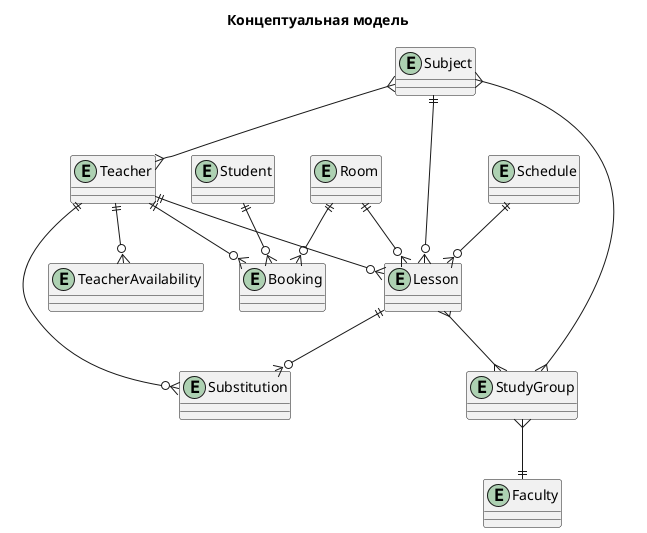

В данном разделе описана структура данных системы, характер их использования и технологический стек, выбранный для обеспечения надежности и производительности.

## 1. Определение сущностей

### 1.1. Пользователи и роли
*   **Teacher (Преподаватель)**:
    *   **Атрибуты**: `teacherid` (PK), `login`, `passwordhash`, `fullname`, `email/telegramid/vk_id`.
    *   **Характер**: Транзакционный (OLTP). Частое чтение, редкая запись.
*   **Student (Студент)**:
    *   **Атрибуты**: `studentid` (PK), `login`, `passwordhash`, `fullname`, `email/telegramid/vk_id`.
    *   **Характер**: Транзакционный (OLTP). Частое чтение, редкая запись.
*   **Employee (Сотрудник учебного отдела)**:
    *   **Атрибуты**: `employeeid` (PK), `login`, `passwordhash`, `fullname`, `email/telegramid/vk_id`.
    *   **Характер**: Транзакционный (OLTP). Частое чтение, редкая запись.

### 1.2. Ресурсы и справочники
*   **Room (Аудитория)**:
    *   **Атрибуты**: `room_id` (PK), `number`, `building`, `capacity`, `equipment` (JSON), `status` (доступна/ремонт).
    *   **Характер**: Справочные данные (OLTP). Частое чтение, редкая запись.
*   **Subject (Учебная дисциплина)**:
    *   **Атрибуты**: `subjectid` (PK), `name`, `requiredcapacity`.
    *   **Характер**: OLTP. Активная запись в начале семестра, далее чтение алгоритмом генерации.
*   **Study Group (Учебная группа)**:
    *   **Атрибуты**: `groupid` (PK), `name`, `studentcount`, `facultyid` (FK), `individualplan_flag`.
*   **Faculty (Факультет)**:
    *   **Атрибуты**: `facultyid` (PK), `name`, `shortname`, `dean_name`.
    *   **Характер**: Редко изменяемый справочник.

### 1.3. Расписание и процессы
*   **Lesson (Пара)**:
    *   **Атрибуты**: `lessonid` (PK), `subjectid` (FK), `teacherid` (FK), `roomid` (FK), `type`, `weekday`, `starttime`, `endtime`, `status`.
    *   **Характер**: OLTP (массовая запись при генерации) и OLAP (отчеты о конфликтах).
*   **Booking (Заявка на бронирование)**:
    *   **Атрибуты**: `bookingid` (PK), `roomid` (FK), `userid` (FK), `reservationdate`, `reservationtimestart`, `reservationtimeend`, `status`.
    *   **Характер**: OLTP. Требует жесткого контроля конкурентного доступа.
*   **Teacher Availability (Доступность)**:
    *   **Атрибуты**: `availabilityid` (PK), `teacherid` (FK), `dayofweek`, `timestart`, `timeend`, `isavailable`, `constrainttype`.
*   **Substitution (Замена)**:
    *   **Атрибуты**: `substitutionid` (PK), `originallessonid` (FK), `substituteteacherid` (FK), `substituteroom_id` (FK), `reason`, `status`.

### 1.4. Логирование
*   **System Log**:
    *   **Атрибуты**: `logid` (PK), `timestamp`, `eventtype`, `userid`, `details` (JSON).
    *   **Характер**: Аналитический (OLAP). Постоянная запись, периодическое чтение массивов.

---

## 2. Определение подходящих технологий хранения

| № | Сущность | Паттерн доступа | Консистентность | Транзакции | Итоговое решение |
|:--|:---|:---|:---|:---|:---|
| 1 | User | OLTP | Strong (ACID) | Нужны | **PostgreSQL** |
| 1.1 | User Session | Key-Value | Eventual | Не нужны | **Redis** |
| 2 | Faculty / Group | OLTP | Strong | Не критичны | **PostgreSQL** |
| 4 | Room | OLTP | Strong | Не критичны | **PostgreSQL** |
| 4.1 | Room (кэш) | Key-Value | Eventual | Не нужна | **Redis** |
| 9 | Lesson | OLTP | Strong | Критичны | **PostgreSQL** |
| 11 | Booking | OLTP | Strong | Критичны (row-level locks) | **PostgreSQL** |
| 12 | SystemLog (MVP) | OLAP | Eventual | Не нужны | **PostgreSQL** |
| 13 | SystemLog (2.0) | Event Streaming | Eventual | Не нужны | **ClickHouse** |
| 14 | Substitution | OLTP | Strong | Нужны (атомарность) | **PostgreSQL** |

## 2. Концептуальная модель

Определяет основные бизнес-сущности и высокоуровневые связи между ними без детализации атрибутов.

---

## 3. Логическая модель

Детализирует структуру сущностей, определяет первичные (PK) и внешние ключи (FK), а также накладывает бизнес-ограничения (Constraints) на уровне логики.

```plantuml
@startuml
!define table entity
title Логическая модель

table "Teacher" {
  * teacher_id : PK
  --
  login : UNIQUE, NOT NULL
  password_hash : NOT NULL
  full_name : NOT NULL
  email : UNIQUE
  telegram_id : UNIQUE
  vk_id : UNIQUE
}

table "Student" {
  * student_id : PK
  --
  login : UNIQUE, NOT NULL
  password_hash : NOT NULL
  full_name : NOT NULL
  email : UNIQUE
  telegram_id : UNIQUE
  vk_id : UNIQUE
}

table "Room" {
  * room_id : PK
  --
  number : NOT NULL
  building : NOT NULL
  capacity : NOT NULL, CHECK (>0)
  equipment
  status : NOT NULL
}

table "Booking" {
  * booking_id : PK
  --
  reservation_date : NOT NULL
  time_start : NOT NULL
  time_end : NOT NULL
  status : NOT NULL
  room_id : FK, NOT NULL
  student_id : FK
  teacher_id : FK
  CHECK (time_start < time_end)
  CHECK (reservation_date >= CURRENT_DATE)
  CHECK ((student_id IS NOT NULL AND teacher_id IS NULL) OR (student_id IS NULL AND teacher_id IS NOT NULL))
}

table "TeacherAvailability" {
  * availability_id : PK
  --
  day_of_week : NOT NULL, CHECK (day_of_week  BETWEEN 1 AND 7)
  time_start : NOT NULL
  time_end : NOT NULL
  is_available : NOT NULL
  constraint_type : NOT NULL
  date_start
  date_end
  teacher_id : FK, NOT NULL
  CHECK (time_start < time_end)
  CHECK ((date_start IS NULL AND date_end IS NULL) OR date_start <= date_end)
}

table "Subject" {
  * subject_id : PK
  --
  name : UNIQUE, NOT NULL
  required_capacity : NOT NULL, CHECK (>0)
}

table "StudyGroup" {
  * group_id : PK
  --
  name : UNIQUE, NOT NULL
  student_count : NOT NULL, CHECK (>0)
  individual_plan_flag : NOT NULL
  faculty_id: FK, NOT NULL
}

table "Faculty" {
  * faculty_id : PK
  --
  name : NOT NULL
  short_name : NOT NULL
  dean_name : NOT NULL
}

table "SubjectGroup" {
  * subject_group_id : PK
  --
  hours_per_week : NOT NULL, CHECK (>0)
  is_mandatory : NOT NULL
  subject_id : FK, NOT NULL
  group_id : FK, NOT NULL
  UNIQUE(subject_id, group_id)
}

table "SubjectTeacher" {
  * subject_teacher_id : PK
  --
  role : NOT NULL
  hours_per_semester : NOT NULL, CHECK (>=0)
  subject_id : FK, NOT NULL
  teacher_id : FK, NOT NULL
  UNIQUE(subject_id, teacher_id, role)
}

table "Lesson" {
  * lesson_id : PK
  --
  type : NOT NULL
  weekday : NOT NULL, CHECK (weekday BETWEEN 1 AND 7)
  semester : NOT NULL, CHECK (semester IN (1, 2))
  start_time : NOT NULL
  end_time : NOT NULL
  status : NOT NULL
  subject_id : FK, NOT NULL
  teacher_id : FK, NOT NULL
  schedule_id : FK, NOT NULL
  room_id : FK, NOT NULL
  CHECK (start_time < end_time)
}

table "LessonGroup" {
  * lesson_group_id : PK
  --
  lesson_id : FK, NOT NULL
  group_id : FK, NOT NULL
  UNIQUE(lesson_id, group_id)
}

table "Substitution" {
  * substitution_id : PK
  --
  reason
  status : NOT NULL
  new_start_time
  new_end_time
  original_lesson_id : FK, NOT NULL
  substitute_teacher_id : FK, NOT NULL
  substitute_room_id : FK
  CHECK (new_start_time IS NULL OR new_end_time IS NULL OR new_start_time < new_end_time)
}

table "Schedule" {
  * schedule_id : PK
  --
  name: NOT NULL
  academic_year: NOT NULL
  semester: NOT NULL
  status : NOT NULL
  valid_from: NOT NULL
  valid_to
  created_at: NOT NULL
  published_at
}

Teacher ||--o{ Booking
Student||--o{ Booking
Room ||--o{ Booking
Teacher ||--o{ TeacherAvailability
Teacher ||--o{ SubjectTeacher
Subject ||--o{ SubjectTeacher
Subject ||--o{ SubjectGroup
StudyGroup ||--o{ SubjectGroup
Teacher ||--o{ Lesson
Subject ||--o{ Lesson
Room ||--o{ Lesson
Lesson ||--o{ LessonGroup
StudyGroup ||--o{ LessonGroup
Schedule ||--o{ Lesson
Lesson ||--o{ Substitution
Teacher ||--o{ Substitution 
Room ||--o{ Substitution 
Faculty ||--o{ StudyGroup  
@enduml
```

---

## 4. Физическая модель

Описывает реализацию на уровне СУБД PostgreSQL: типы данных, ограничения по размеру строк и механизмы архивации.

```plantuml
@startuml
!define table entity
title Физическая модель

table "Teacher" {
  * teacher_id : INT (PK)
  --
  login : VARCHAR(50) UNIQUE NOT NULL
  password_hash : VARCHAR(255) NOT NULL
  full_name : VARCHAR(100) NOT NULL
  email : VARCHAR(100) UNIQUE
  telegram_id : VARCHAR(50) UNIQUE
  vk_id : VARCHAR(50) UNIQUE
}

table "Student" {
  * student_id : INT (PK)
  --
  login : VARCHAR(50) UNIQUE NOT NULL
  password_hash : VARCHAR(255) NOT NULL
  full_name : VARCHAR(100) NOT NULL
  email : VARCHAR(100) UNIQUE
  telegram_id : VARCHAR(50) UNIQUE
  vk_id : VARCHAR(50) UNIQUE
}

table "Room" {
  * room_id : INT (PK)
  --
  number : VARCHAR(10) NOT NULL
  building : VARCHAR(50) NOT NULL
  capacity : INT NOT NULL CHECK (capacity > 0)
  equipment : TEXT
  status : VARCHAR(20) NOT NULL
}

table "Booking" {
  * booking_id : INT (PK)
  --
  reservation_date : DATE NOT NULL
  time_start : TIME NOT NULL
  time_end : TIME NOT NULL
  status : VARCHAR(20) NOT NULL
  room_id : INT NOT NULL (FK)
  teacher_id : INT (FK)
  student_id : INT (FK)
  CHECK (time_start < time_end)
  CHECK (reservation_date >= CURRENT_DATE)
  CHECK ((student_id IS NOT NULL AND teacher_id IS NULL) OR (student_id IS NULL AND teacher_id IS NOT NULL))
}

table "Booking_archive" {
  * booking_id : INT (PK)
  --
  reservation_date : DATE NOT NULL
  time_start : TIME NOT NULL
  time_end : TIME NOT NULL
  status : VARCHAR(20) NOT NULL
  room_id : INT NOT NULL
  user_id : INT NOT NULL
  archived_at : TIMESTAMP NOT NULL DEFAULT CURRENT_TIMESTAMP
  CHECK (time_start < time_end)
}

table "TeacherAvailability" {
  * availability_id : INT (PK)
  --
  day_of_week : INT NOT NULL CHECK (day_of_week BETWEEN 1 AND 7)
  time_start : TIME NOT NULL
  time_end : TIME NOT NULL
  is_available : BOOLEAN NOT NULL
  constraint_type : VARCHAR(20) NOT NULL
  date_start : DATE
  date_end : DATE
  teacher_id : INT NOT NULL (FK)
  CHECK (time_start < time_end)
  CHECK ((date_start IS NULL AND date_end IS NULL) OR date_start <= date_end)
}

table "Subject" {
  * subject_id : INT (PK)
  --
  name : VARCHAR(200) UNIQUE NOT NULL
  required_capacity : INT NOT NULL CHECK (required_capacity > 0)
}

table "Faculty" {
  * faculty_id : INT (PK)
  --
  name : VARCHAR(150) NOT NULL
  short_name : VARCHAR(20) NOT NULL
  dean_name : VARCHAR(100) NOT NULL
}

table "StudyGroup" {
  * group_id : INT (PK)
  --
  name : VARCHAR(50) UNIQUE NOT NULL
  student_count : INT NOT NULL CHECK (student_count > 0)
  individual_plan_flag : BOOLEAN NOT NULL
  faculty_id : INT NOT NULL (FK)
}

table "SubjectGroup" {
  * subject_group_id : INT (PK)
  --
  hours_per_week : DECIMAL(4,1) NOT NULL CHECK (hours_per_week > 0)
  is_mandatory : BOOLEAN NOT NULL
  subject_id : INT NOT NULL (FK)
  group_id : INT NOT NULL (FK)
  UNIQUE(subject_id, group_id)
}

table "SubjectTeacher" {
  * subject_teacher_id : INT (PK)
  --
  role : VARCHAR(30) NOT NULL
  hours_per_semester : INT NOT NULL CHECK (hours_per_semester >= 0)
  subject_id : INT NOT NULL (FK)
  teacher_id : INT NOT NULL (FK)
  UNIQUE(subject_id, teacher_id, role)
}

table "Lesson" {
  * lesson_id : INT (PK)
  --
  type : VARCHAR(30) NOT NULL
  weekday : INT NOT NULL CHECK (weekday BETWEEN 1 AND 7)
  semester : INT NOT NULL CHECK (semester IN (1,2))
  start_time : TIME NOT NULL
  end_time : TIME NOT NULL
  status : VARCHAR(20) NOT NULL
  subject_id : INT NOT NULL (FK)
  teacher_id : INT NOT NULL (FK)
  schedule_id : INT NOT NULL (FK)
  room_id : INT NOT NULL (FK)
  CHECK (start_time < end_time)
}

table "Lesson_archive" {
  * lesson_id : INT (PK)
  --
  type : VARCHAR(30) NOT NULL
  weekday : INT NOT NULL
  semester : INT NOT NULL
  start_time : TIME NOT NULL
  end_time : TIME NOT NULL
  status : VARCHAR(20) NOT NULL
  subject_id : INT NOT NULL (FK)
  teacher_id : INT NOT NULL (FK)
  schedule_id : INT NOT NULL (FK)
  room_id : INT NOT NULL (FK)
  archived_at : TIMESTAMP NOT NULL DEFAULT CURRENT_TIMESTAMP
  CHECK (start_time < end_time)
}

table "LessonGroup" {
  * lesson_group_id : INT (PK)
  --
  lesson_id : INT NOT NULL (FK)
  group_id : INT NOT NULL (FK)
  UNIQUE(lesson_id, group_id)
}

table "Substitution" {
  * substitution_id : INT (PK)
  --
  reason : TEXT
  status : VARCHAR(20) NOT NULL
  new_start_time : TIME
  new_end_time : TIME
  original_lesson_id : INT NOT NULL (FK)
  substitute_teacher_id : INT NOT NULL (FK)
  substitute_room_id : INT (FK)
  CHECK (new_start_time IS NULL OR new_end_time IS NULL OR new_start_time < new_end_time)
}

table "Substitution_archive" {
  * substitution_id : INT (PK)
  --
  reason : TEXT
  status : VARCHAR(20) NOT NULL
  new_start_time : TIME
  new_end_time : TIME
  original_lesson_id : INT NOT NULL
  substitute_teacher_id : INT NOT NULL
  substitute_room_id : INT
  archived_at : TIMESTAMP NOT NULL DEFAULT CURRENT_TIMESTAMP
  CHECK (new_start_time IS NULL OR new_end_time IS NULL OR new_start_time < new_end_time)
}

table "Schedule" {
  * schedule_id : INT PK
  --
  name: VARCHAR(50) NOT NULL
  academic_year: VARCHAR(9) NOT NULL
  semester: VARCHAR(10) NOT NULL
  status : VARCHAR(20) NOT NULL
  valid_from: DATE NOT NULL
  valid_to: DATE
  created_at: TIMESTAMP NOT NULL
  published_at: TIMESTAMP 
}

Teacher ||--o{ Booking
Student ||--o{ Booking
Room ||--o{ Booking
Teacher ||--o{ TeacherAvailability
Teacher ||--o{ SubjectTeacher
Subject ||--o{ SubjectTeacher
Subject ||--o{ SubjectGroup
StudyGroup ||--o{ SubjectGroup
Faculty ||--o{ StudyGroup
Teacher ||--o{ Lesson
Subject ||--o{ Lesson
Room ||--o{ Lesson
Lesson ||--o{ LessonGroup
StudyGroup ||--o{ LessonGroup
Lesson ||--o{ Substitution
Teacher ||--o{ Substitution
Room ||--o{ Substitution
Schedule ||--o{ Lesson
@enduml
```
