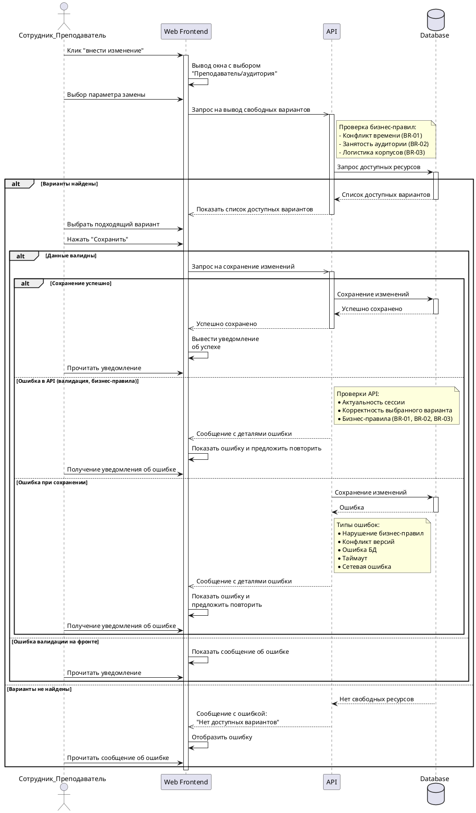

В данном разделе представлена диаграмма последовательности (Sequence Diagram), описывающая архитектурное взаимодействие компонентов системы при выполнении сценария «Интеллектуальный поиск замены при непредвиденных обстоятельствах» (UC-3).

## Диаграмма последовательности

## Описание взаимодействия компонентов

В процессе принимают участие следующие компоненты:
*   **Акторы:** Сотрудник учебного отдела или Преподаватель.
*   **Web Frontend:** Клиентская часть приложения, отвечающая за интерфейс и первичную валидацию действий пользователя.
*   **API:** Серверная часть, реализующая основную бизнес-логику и проверки правил (Business Rules).
*   **Database:** База данных, хранящая актуальное расписание и информацию о доступности ресурсов.

### Основные сценарии (Flows)

1.  **Запрос свободных ресурсов:** Пользователь инициирует поиск замены. API обращается к БД с учетом строгих бизнес-правил (отсутствие накладок, логистика между корпусами).
2.  **Успешное сохранение (Happy Path):** Если подходящий вариант найден и выбран пользователем, фронтенд отправляет запрос на сохранение. API валидирует сессию и данные, после чего изменения успешно фиксируются в БД.
3.  **Обработка исключений:** Диаграмма предусматривает обработку различных отказов на всех уровнях:
    *   Отсутствие свободных ресурсов в БД (информационное сообщение).
    *   Ошибки клиентской валидации.
    *   Ошибки бизнес-логики на уровне API (попытка забронировать уже занятую аудиторию).
    *   Инфраструктурные ошибки (таймауты БД, сетевые сбои).