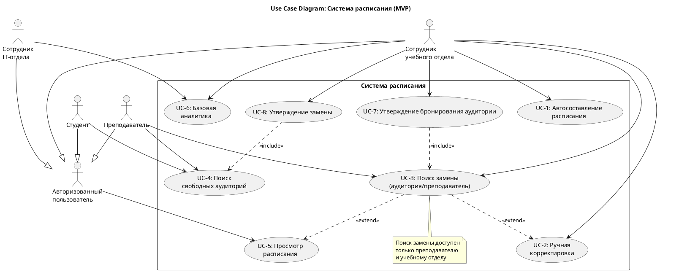

В данном разделе представлена UML-диаграмма вариантов использования (Use Case). Она наглядно демонстрирует, какие функции системы (прецеденты) доступны различным ролям (акторам).

## Диаграмма вариантов использования

## Описание ролей (Акторов)

В системе реализовано наследование ролей: все пользователи наследуют базовую роль **Авторизованный пользователь**, что дает им право на базовые функции (например, просмотр расписания).

*   **Сотрудник учебного отдела:** Обладает максимальными правами в рамках бизнес-логики. Может инициировать автоматическое составление, вносить ручные корректировки, подтверждать бронирования и замены, а также просматривать аналитику.
*   **Преподаватель:** Может искать свободные аудитории и инициировать поиск замены (как аудитории, так и преподавателя).
*   **Студент:** Имеет доступ к просмотру расписания и поиску свободных аудиторий (например, для проектной работы или самоподготовки).
*   **Сотрудник IT-отдела:** Имеет доступ к базовой аналитике системы для мониторинга ошибок и нагрузки.